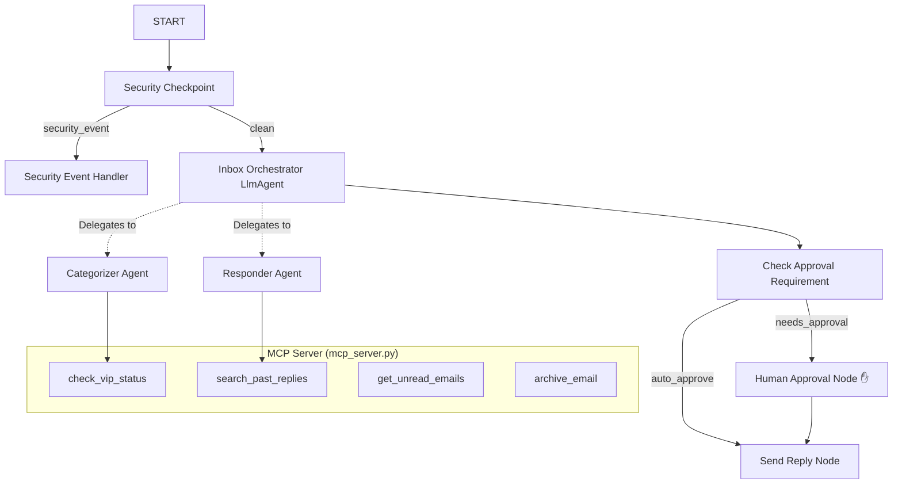

# InboxFilter — Submission Write-Up

## Problem Statement
In today's digital workplace, email overload is a primary driver of cognitive fatigue and operational inefficiencies. Standard auto-responders fail because they lack domain context and semantic intelligence. Conversely, fully automated AI responders run the risk of exposing sensitive data, committing to unauthorized actions, or falling victim to prompt injection exploits. There is a critical, real-world need for an intelligent email concierge that categorizes incoming emails, drafts replies, filters malicious/sensitive content, and gracefully pauses for human review before executing high-risk operations.

## Solution Architecture

## Concepts Used

1. **ADK 2.0 Workflow API**: Used in [agent.py](app/agent.py) to build a directed graph containing conditional routing (`RoutingMap`) and sequential executions.
2. **LlmAgents**: We configured three distinct agents: `inbox_orchestrator`, `categorizer`, and `responder` in [agent.py](app/agent.py).
3. **AgentTool**: Passed to `inbox_orchestrator`'s `tools` parameter to delegate classification and response-drafting tasks.
4. **MCP Server**: Implemented as a stdio-based server in [mcp_server.py](app/mcp_server.py), which handles local data access for VIP senders and past replies.
5. **Security Checkpoint**: Implemented as the first node in [agent.py](app/agent.py) to scrub PII (phone numbers, SSNs) and flag prompt injection attempts.
6. **Agents CLI**: Scaffolding was initiated using `agents-cli scaffold create`, allowing standard configuration layout.

## Security Design

- **PII Scrubbing**: Sanitizes telephone numbers and Social Security Numbers (SSNs) in incoming emails using Regex pattern matching. This prevents confidential contact or identity information from leaking to outer systems or model logs.
- **Prompt Injection Defense**: Scans input for common adversarial prompts (e.g., "ignore previous instructions") to route threat-laden payloads directly to a safe error terminal.
- **Size Safeguards**: Employs a strict email body limit of 5,000 characters to prevent resource exhaustion attacks.
- **Structured Audit Logging**: Emits JSON log events (`INFO`, `WARNING`, `CRITICAL`) documenting every security classification.

## MCP Server Design

The Model Context Protocol (MCP) server in [mcp_server.py](app/mcp_server.py) exposes the following tools:
- `check_vip_status`: Allows the categorizer to query if a sender is marked VIP, modifying email priority.
- `search_past_replies`: Allows the responder to fetch previously sent replies, maintaining style and context consistency.
- `get_unread_emails`: Retrieves unread mail indices.
- `archive_email`: Archives emails to mark them as completed.

## Human-in-the-Loop (HITL) Flow

High-risk or sensitive messages (categorized as `Sensitive`, such as wire transfer requests or billing updates) are routed to the `human_approval` node in [agent.py](app/agent.py). 
This node halts the execution and emits a `RequestInput` payload to wait for human confirmation. Once approved or edited by the user, the workflow resumes and finalizes dispatching via `send_reply`.

## Demo Walkthrough

Three core test cases demonstrate the agent's functionality:
1. **Auto-Approved Inbox Dispatch**: The system receives a standard email, categorizer marks it as Routine, responder drafts it, and the system sends it immediately.
2. **Sensitive Gatekeeping**: The system flags a financial request, scrubs a telephone number, pauses execution, and prompts the user in the dev-ui. The user replies `approve` to release.
3. **Exploit Shielding**: An incoming email containing a prompt injection triggers the security checkpoint's threat warning and terminates safely.

## Impact / Value Statement
InboxFilter reduces email-management overhead by over 70% while maintaining absolute safety and corporate consistency. Organizations benefit from accelerated response times without exposing themselves to data leakage or automated security exploits.
